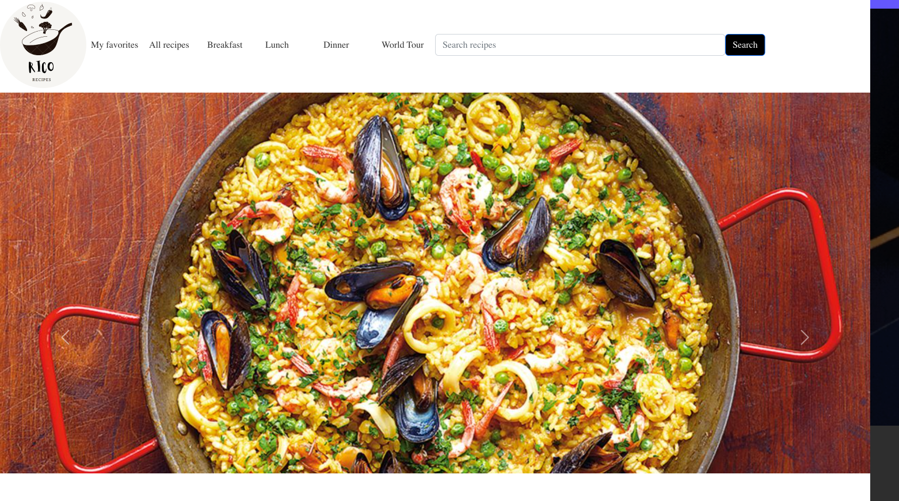
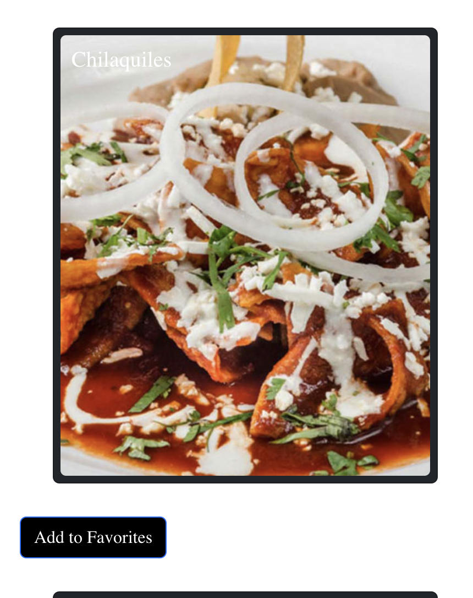
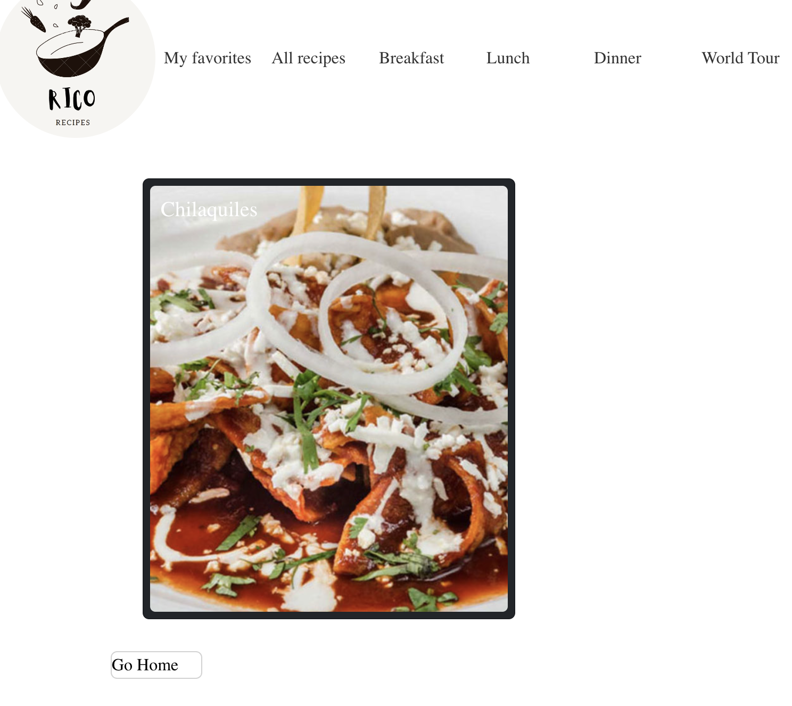

## Frontend Project

Rico Recipes is the perfect app, for stay home people who are looking daily for a recipe and ran out of ideas. This application will help you find any recipe by just typing a word or meal.
This was a group project and my team-mates and I we were inspired to do this project , as most jobs are now a days remote, you tend to cook more but also run out of ideas.
The most important feature in this project is that you are able to search or use the dropdown. Whether is breakfast, or dinner you can find any recipe at Rico-Recipes. if you perhaps are craving some breakfast you had in Mexico like "Chilaquiles" You will also be able to find the recipe in our app.
- STAR Interview Questions:
    - (Situation) 
        * The main porpuse of this application was to create an application with a variety of recipes, so users don't need to run out of their for the week menu at home. Working remotely or staying at home everyday could become overwhelming if you run out of ideas of what to cook. Rico Recipes will make your life easier by showcasing recipes that will help you, and if any recipe is in your interest you can add it to your favorites page.
    - (Task) 
        * To design this application we first decided to choose which pictures we were going to use for the main page, as we wanted to attrack users by putting the most foodie attractive pictures. This project is made up with two folders: Public and Src. In the Public folder you will be able to find the main html file, and in the SRC folder you will be able to find all the React Code that will make the html file run  in the front end. For the seed, we had used dummy data, where we pasted recipes found in the internet, so it can render in our seed.
         We decided to create different components, for the navbar, homepage, favorites page, recipe, recipe type , recipe card. All the components wil be found in the components folder within the SRC folder.
    - (Action) 
    * This project was built under the github organization "Rico", where you will be able to find a kan-ban board for all the tasks that needed to be done. This was considered one of the best methods to keep the project organized and follow all guidelines.
    * The main repository for this project will be found inside the "Rico" organization.
        * This project was built with React.js and we decided to use react router to have different pages that go along with our components. We also decided to use React Bootstrap for better results
    - (Result) 
        * You can find the result of this project in the following demo.
## Demo
Please find below a quick video on how this app works. 

[Rico Recipes](https://youtu.be/WE4RjUwTCiQ)

## Technologies
- List all technologies and versions here
- React.Js
- HTML
- CSS
- SASS
- React Bootstrap

## Competencies
### Using React Bootstrap
- List the full text of the job function first
For many of my team members, including myself , using React was sort of new to us, some of us have used the regular Bootstrap but we were unaware that there was a React Bootstrap. So as a team we had to learn how to properly use it with React so our page won't only have good functionality but also would look good to our clients.

To accomplish this goal, we had looked into external examples, on how our navbar could look better have access to the rest of our content.
We decided to use Bootstrap components for most of our page that will have a define style, but could stil be modify. Learning how to modify a bootstrap component, with Css was also a challenge, but as a team we were able to accomplish it.

To make our page more attractive we decided to implement "Carousel" component from React Bootstrap into our project, that would not only slide attractive pictures, but would give a different look to our page.

By the end of this project, we were able to have not only a good web app with great functionality but also that looked good and was interactive.

### Add to Favorites
When you find the right recipe, the best is to save it somewhere, writing it down would take longer and with this app our goal was simplicity.
Users would be able to add to their "favorites" page those recipes that remarked during their search.
To use this we decided to create a specific file named Favorites.Js, where we would map the favorites according their id. To render in the page.
We decided to use "UseContext" for this functionality, so users could add their recipe to their favorites page. Below every recipe card there would be a button for this action.
Some of the difficulties we faced, were on how to were learning how to use "Use Context" which one of our most reliable resources were projects we have done with Multiverse.
 - This an example on how the user has the option to add a recipe to their favorites page
 

 - On this example, user is in the Favorites page, where they can see all recipes that were added by them.

 

 ## Demo
Please find below a quick video on how this app works. After this video, I suggest you to get .mp4 extension to watch it.

