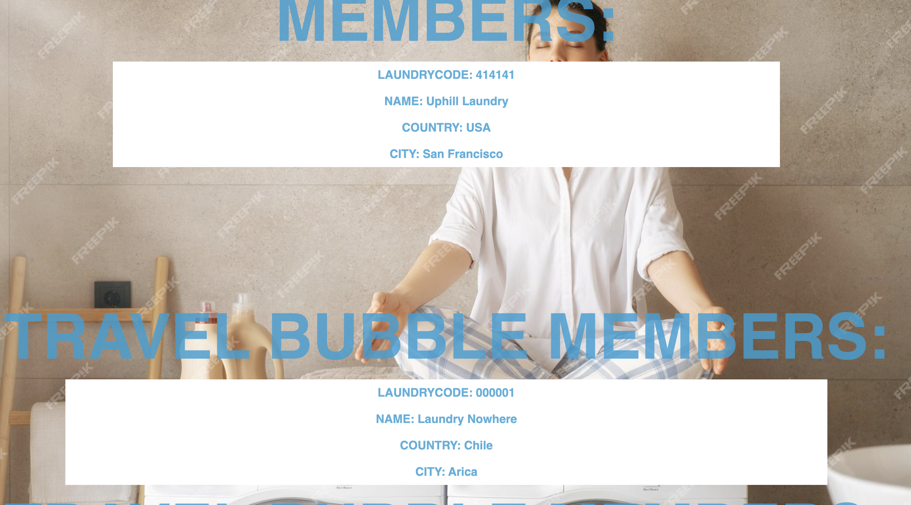
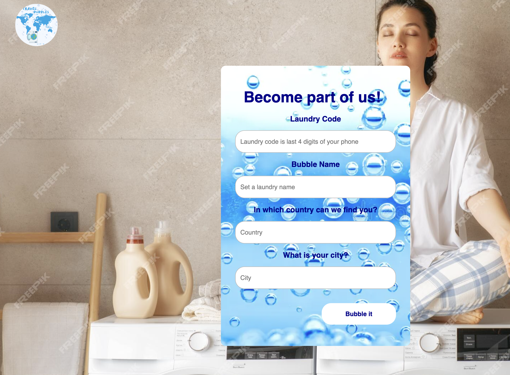

## Hackaton Project
Give a high-level overview of the project purpose
Travel Bubbles is an application where main users are travellers. Being away from home and having so many adventures can lead to forgetting do your laundry, unfortunately there are two option, paying a high amount of money to your hotel to do the laundry or washing it yourself in your own hotel room. 
I was inspired to do this project, for the same reason that I was a world traveller for many years, and I had no time left to do the laundry and ending up paying high amounts of money to have it done.
The most important feature, is that this application will allow people to lend their home laundry to travellers, and charged them per use, sort of like an air bnb but for laundries. At the moment the application will only allow you to sign up your "home brand laundry" and become part of the app, the future projections for this application is to have a good amount of "home laundries" and allow travellers to sign up for this app, and be able to find the nearest laundry from their hotel anywhere in the world. Every laundry owner is allow to set up their prices, and delivery availability or in person service.

- STAR Interview Questions:
    - (Situation) 
        * The main porpuse for this application is to allow travellers to find via an application, the nearest local laundry, that locals in the area are willing to rent so travellers can have cheaper options, and faster option for their laundry while travelling.
    - (Task) 
         * For this application I have used Golang, Mux router and simple HTML and CSS for the front end UI design. The structure I have followed is that all the main code is located in the main.go file. 
            In the assets folder you will be able to find the CSS file. and In the templates folder you will be able to find all the HTML files that connect with the back-end for the application to run.
    - (Action) 
        * To achieve the desire result I first needed to build all the routes needed in Golang and using Gorilla Mux Router. To achieve this I had to reached a couple of resources to learn it's used. Once I was able to test this routes in Postman, then I was able to connect it with the front end.
    - (Result) 

        * Being able to create routes that will work together with a simple front end, came as a result of a beautiful site.
        - Dashboard or main page
        
        - List of laundries available
        
        - Sign up form, to be part of Travel Bubbles
        
        - About us page, for users who just heard about "Travel bubbles"
        
         * To see the result of this application please click on the demo below:

## Demo
Please find below a quick video on how this app works. 

[Travel Bubbles](https://www.youtube.com/watch?v=PTfLnhe1lV4)

## Technologies
- GoLang
- Gorilla mux router
- HTML
- CSS
- Postman

## Competencies
### JF 6.4
## Works independently and takes responsibility. For example, has a disciplined and responsible approach to risk, and stays motivated and committed when facing challenges
 Rapid learning and adaptability
- Learning Golang
Quickly acquired foundational knowledge in Golang within a short timeframe.
* Demonstrated ability to grasp core programming concepts in Golang after a completing a 2 week-course, showcasing a string aptitude for learning new technologies.
* Adapted swiftly to the Gorilla Mux router, showcasing an understanding of complex routing mechanisms despite limited prior experience.

I had some knowledge on how to build your routes and request in Node js. but implementing it in Golang was quite a challenge, although most programming languages follow some same design patterns, the method and syntax could vary, so this was on one of the main situations where I needed to learn how to apply it with Golang.

The action I decided to take was to take new courses for Golang besides the one I've taken, and start watching youtube videos with similar examples and read documentation as is the main source to find the best resources to apply it with Golang.
 

### JF 5.5
## Understands and can apply structured techniques to problem solving, can debug code and can understand the structure of programmes to identify and resolve issues
 Efficient Problem-Solving and Project Execution
Built a functional full-stack project in Golang within a week, showcasing effective problem-solving skills, project management, and integration with the front-end techniques.
* Succesfully implemented routes in Golang using Gorilla Mux, demonstrating adept problem-solving abilities in overcoming technical challenges.
* Collaborated with front-end development, learning how to integrate back-end functionality seamlessly with HTML, ensuring a smooth user experience and full stack functionality.
* Completed the entire project within a week, demonstrating efficient time management and project execution skills, despite the need to learn and implement full stack integration from scratch.
* Able to fix bugs by my own, in a complete new framework, by doing research.
 
 By the end of the project, I was able to connect back-end with front-end having a result of full-stack.
- Connect the competentcy to this project